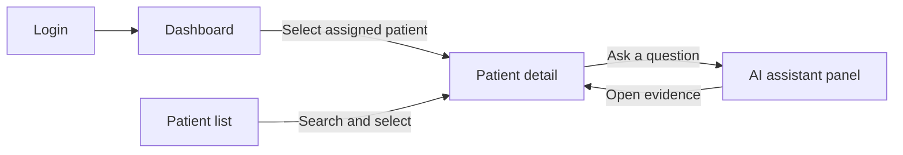
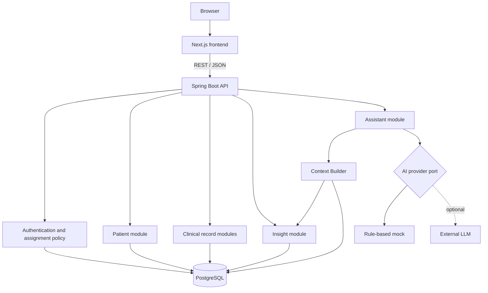
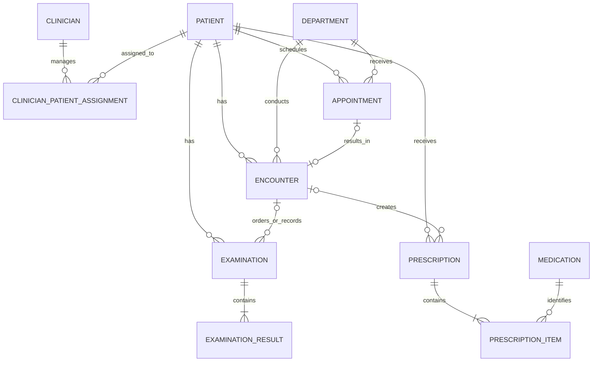
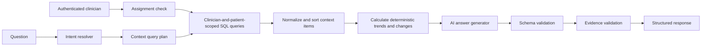

# Patienty Initial Architecture

> Status: Draft v0.2
>
> Scope: Authenticated MVP using synthetic patient data only

## 1. Product definition

Patienty is a clinician-facing patient context copilot. It does not diagnose a
patient or recommend treatment. Its job is to help a clinician understand recent
changes in a patient's record quickly and trace every generated statement back to
the source record.

### Primary success criterion

A clinician can open a patient and identify the following within 10 seconds:

1. who the patient is;
2. what changed recently;
3. what needs attention;
4. which records support those statements.

### MVP principles

- Source records remain the system of record. AI output is a derived explanation.
- PostgreSQL selects and orders structured records; an LLM never queries the
  database directly.
- Deterministic application code calculates numeric trends and medication changes.
- Every AI observation must reference evidence supplied by the Context Builder.
- Every patient query is scoped to the authenticated clinician's assignments.
- The application uses synthetic data and displays that fact throughout the UI.
- Local development is the default. AWS, Redis, a vector database, and RAG are not
  required for the MVP.

### Out of scope

- diagnosis, prognosis, treatment advice, and medication recommendations;
- real patient data or production hospital use;
- EMR, insurance, billing, and pharmacy integrations;
- patient-facing features;
- appointment creation, cancellation, or live queue management;
- multi-hospital tenancy and fine-grained hospital RBAC beyond `DOCTOR` and `ADMIN`;
- regulatory certification and cloud infrastructure.

## 2. MVP experience

The MVP has four pages. The AI assistant is part of the patient detail page rather
than a separate destination.



### 2.1 Login `/login`

- authenticate a seeded clinician with email and password;
- establish a server-side session using an `HttpOnly` cookie;
- obtain a session-backed CSRF token before state-changing requests;
- redirect an authenticated clinician to the dashboard;
- show a generic error for invalid credentials without revealing whether an email
  exists.

No access token or password is stored in browser storage.

### 2.2 Dashboard `/`

The dashboard is an entry point, not a large analytics product.

- today's appointments for the signed-in clinician's assigned patients;
- assigned patients with detected changes that need review;
- recently viewed patients, kept in browser storage for the MVP;
- direct navigation to patient details.

Department analytics, operational metrics, and large aggregate charts are deferred.

### 2.3 Patient list `/patients`

- search by patient name or patient number;
- filter by department and appointment status;
- sort by most recent encounter;
- show name, age, sex, department, last encounter date, and an attention indicator;
- use server-side pagination.

Search and filters operate only over patients assigned to the signed-in clinician.
An administrator may receive a broader scope through an explicit backend policy;
the frontend never decides this scope.

Phone-number search is excluded initially because it adds little demonstration value
and makes the product feel unnecessarily dependent on personal information.

### 2.4 Patient detail `/patients/{patientId}`

Desktop layout uses approximately two thirds of the width for the clinical record
and one third for the assistant.

```text
+-----------------------------------------------------------------------+
| Patient identity | Last encounter | Next appointment | Synthetic data |
+----------------------------------------------+------------------------+
| 10-second summary                            | AI assistant           |
| Changes since the previous encounter         | Suggested questions    |
| Up to three items that need review           | Answer                 |
+----------------------------------------------+ Evidence links         |
| Measurement trends                           |                        |
+----------------------------------------------+                        |
| Recent timeline                              |                        |
+----------------------------------------------+                        |
| Current prescriptions                        |                        |
+----------------------------------------------+------------------------+
```

The main sections can later become tabs, but the first version should keep the
summary, major trends, recent timeline, and current prescriptions visible on one
page. Selecting AI evidence scrolls to and highlights the related source record.

### Required UI states

- area-level skeletons while data is loading;
- an empty-result state with a clear-filter action;
- “No record available” instead of implying that a missing result is normal;
- “No notable change detected” when data exists but no change is found;
- a partial-data notice identifying missing record categories;
- suggested questions before the first AI request;
- an evidence-insufficient response instead of speculation;
- a retry action when AI generation fails while source records remain usable;
- icon and text indicators in addition to color for abnormal values.

The UI uses “needs review” and “change detected” instead of diagnostic labels such
as “danger” or “disease.”

## 3. System architecture

Patienty starts as a modular monolith with a separately deployed web client.



### Backend module boundaries

```text
backend/
└── src/main/java/.../patienty/
    ├── auth/             # session login, clinician identity, assignment policy
    ├── patient/          # identity, search, patient profile
    ├── appointment/      # scheduled visits and statuses
    ├── encounter/        # completed clinical encounters
    ├── examination/      # examinations and numeric/text results
    ├── prescription/     # prescriptions and medication catalog
    ├── insight/          # deterministic trends and change detection
    ├── assistant/        # context building, provider port, evidence validation
    └── shared/           # API errors, paging, time, common identifiers
```

Modules communicate through application services rather than reaching into another
module's repositories. This keeps an eventual split possible without paying the
cost of microservices now.

### Frontend boundaries

```text
frontend/src/
├── app/                  # Next.js routes and layouts
├── features/
│   ├── auth/
│   ├── dashboard/
│   ├── patients/
│   └── assistant/
├── components/           # reusable presentation components
├── lib/api/              # generated or typed API client
└── lib/format/           # dates, measurements, medication instructions
```

Server Components load the initial page data where practical. Interactive search,
filters, charts, evidence highlighting, and the assistant use Client Components.
The Spring Boot OpenAPI document becomes the source for generated TypeScript API
types once the first endpoints stabilize.

### Runtime and environment files

```text
Local:      Next.js :3000  -->  Spring Boot :8080  -->  PostgreSQL :5432
Deployment: Next.js        -->  Spring Boot       -->  Neon Postgres
```

PostgreSQL runs in Docker Compose. The frontend and backend run as local processes
for fast reload and debugging. A full-container setup can be added for demos later.

The repository uses two ignored runtime files:

| File | Purpose |
| --- | --- |
| `.env.local` | Local frontend, backend, and Docker Compose values. |
| `.env` | Deployment values, including the Neon connection settings. |

Only `.env.example` is committed. It documents both modes without real secrets.
The default `local` profile imports `.env.local`. Deployment activates `prod`
or `prod,demo` through a CLI argument or hosting setting before the `prod`
profile imports `.env`; profile activation is never delegated to a
profile-specific env import.
Neon uses separate `main` and `development` branches so schema work is verified
before the deployment database is changed.

The frontend sends session cookies with every API request. CORS allows only the
configured frontend origin and credentials. Local cookies may use
`SameSite=Lax; Secure=false`; cross-site HTTPS deployment uses
`SameSite=None; Secure=true`.

## 4. Domain model



### Core entities

| Entity | Important fields | Notes |
| --- | --- | --- |
| `clinician` | `id`, `name`, `email`, `password_hash`, `role`, `active` | Authenticated medical staff account. Passwords are BCrypt hashes. |
| `clinician_patient_assignment` | `clinician_id`, `patient_id`, `assigned_at` | The authorization boundary for doctor-visible patient data. |
| `patient` | `id`, `patient_number`, `name`, `birth_date`, `sex_code`, `phone_normalized` | Age is calculated, never stored. |
| `department` | `code`, `display_name` | Small reference table used for filtering. |
| `appointment` | `patient_id`, `department_code`, `scheduled_start`, `scheduled_end`, `status`, `reason` | Read-only in the MVP. |
| `encounter` | `patient_id`, `appointment_id?`, `department_code`, `occurred_at`, `chief_complaint`, `note`, `status` | Represents one clinical visit and its record. |
| `examination` | `patient_id`, `encounter_id?`, `performed_at`, `type`, `status` | Groups related examination results. |
| `examination_result` | `examination_id`, `metric_code`, `display_name`, `numeric_value?`, `text_value?`, `unit?`, `reference_min?`, `reference_max?`, `abnormal_flag` | Exactly one of numeric or text value is present. |
| `medication` | `id`, `code`, `name`, `default_unit?` | Medication reference data. |
| `prescription` | `patient_id`, `encounter_id?`, `prescribed_at`, `status` | A prescription event, not proof that medicine was taken. |
| `prescription_item` | `prescription_id`, `medication_id`, `dose_value`, `dose_unit`, `frequency_per_day`, `route?`, `start_date`, `end_date?`, `instructions?` | One medication instruction. |

### Data rules

- A clinician email is normalized and unique.
- A clinician and patient pair has at most one active assignment.
- Every patient-facing repository query includes the authenticated clinician scope.
- An unassigned patient is returned as `404 Not Found` to avoid identifier probing.
- Internal identifiers use UUIDs; `patient_number` is unique and safe for display.
- Instants use PostgreSQL `timestamptz`; birth dates and medication periods use
  `date`.
- Medical records are not overwritten or hard-deleted. Statuses such as `VOIDED`
  and `CANCELLED` preserve history.
- Numeric results require a stable `metric_code` and unit. Trends only compare
  compatible units.
- A prescription contains at most one instruction row for the same medication,
  keeping medication-change comparisons deterministic.
- An examination contains at most one result row for the same metric code.
- Systolic and diastolic blood pressure are stored as separate metric codes and
  grouped by the same examination.
- `reference_min` cannot exceed `reference_max`; dose and frequency values must be
  positive; appointment end must be after its start.
- An encounter can reference at most one appointment.
- An examination or prescription may exist without an encounter, but its patient
  must match the linked encounter's patient when a link is present.

Primary query indexes are:

```text
clinician(lower(email))
clinician_patient_assignment(clinician_id, patient_id)
patient(patient_number)
patient(lower(name))
encounter(patient_id, occurred_at desc)
examination(patient_id, performed_at desc)
examination_result(metric_code, examination_id)
prescription(patient_id, prescribed_at desc)
appointment(patient_id, scheduled_start desc)
appointment(status, scheduled_start)
```

AI answers and chat history are not persisted in the first version. If caching is
needed later, an `ai_analysis` record must store the structured response plus a
manifest of source IDs and versions used to produce it.

## 5. API surface

The initial API is read-heavy and versioned under `/api/v1`. Except for the
CSRF bootstrap and login endpoints, every endpoint requires an authenticated
clinician session.

| Method | Path | Purpose |
| --- | --- | --- |
| `GET` | `/api/v1/auth/csrf` | Create or reuse a session and return its CSRF token and header name. |
| `POST` | `/api/v1/auth/login` | Authenticate a clinician and rotate the session identifier. |
| `GET` | `/api/v1/auth/me` | Return the signed-in clinician's identity and role. |
| `POST` | `/api/v1/auth/logout` | Invalidate the current clinician session. |
| `GET` | `/api/v1/dashboard` | Today's appointments and patients needing review. |
| `GET` | `/api/v1/patients` | Search, filter, sort, and page patients. |
| `GET` | `/api/v1/patients/{patientId}` | Patient header, recent encounter, current prescriptions, and next appointment. |
| `GET` | `/api/v1/patients/{patientId}/timeline` | Unified encounter, examination, and prescription-change timeline. |
| `GET` | `/api/v1/patients/{patientId}/measurements` | Time-series values filtered by metric and period. |
| `POST` | `/api/v1/patients/{patientId}/ai/queries` | Evidence-backed answer for one patient question. |

The dashboard and every patient endpoint derive their clinician scope from the
server session. They never accept a clinician ID from a request parameter or body.
Patient detail, timeline, measurements, and AI queries return `404 Not Found` when
the patient is not assigned to the signed-in clinician.

Example patient query:

```http
GET /api/v1/patients?q=PAT-000124&department=INTERNAL_MEDICINE&page=0&size=20
```

Example AI request:

```json
{
  "question": "What changed since the previous encounter?"
}
```

Example AI response:

```json
{
  "status": "ANSWERED",
  "answer": "Blood pressure increased across the last three measurements, and the latest prescription replaced Medication A with Medication B.",
  "observations": [
    {
      "type": "MEASUREMENT_TREND",
      "level": "ATTENTION",
      "text": "Systolic blood pressure increased from 128 to 142 mmHg.",
      "evidenceIds": [
        "examination-result:5b5d7a5d",
        "examination-result:c73f2c8a"
      ]
    }
  ],
  "evidence": [
    {
      "id": "examination-result:c73f2c8a",
      "sourceType": "EXAMINATION_RESULT",
      "occurredAt": "2026-08-20T09:30:00+09:00",
      "label": "Blood pressure examination on 2026-08-20"
    }
  ],
  "generatedAt": "2026-08-27T12:00:00+09:00"
}
```

AI response status is one of:

- `ANSWERED` — the available records support an answer;
- `INSUFFICIENT_EVIDENCE` — the question is allowed but evidence is missing;
- `UNSUPPORTED_REQUEST` — the question requests diagnosis, treatment, or another
  unsupported action.

A numeric confidence score is intentionally excluded because it could be mistaken
for clinical certainty.

## 6. AI Context Builder



### Supported intents

| Intent | Selected context | Deterministic work |
| --- | --- | --- |
| `RECENT_CHANGES` | Encounters, examinations, and prescriptions from the last six months. | Trend and change detection. |
| `RECENT_EXAMINATIONS` | Recent examinations only. | Abnormal flags and unit-safe ordering. |
| `MEDICATION_CHANGES` | The two latest relevant prescription states. | Added, stopped, and dose-changed items. |
| `MEASUREMENT_TREND` | Requested metric and date range. | Direction, delta, and compatible-unit check. |
| `ENCOUNTER_TIMELINE` | Encounters in the requested period. | Chronological grouping. |
| `UNSUPPORTED` | No patient context. | Safe refusal. |

Each selected record becomes a minimal context item rather than a serialized JPA
entity:

```text
ContextItem
├── evidenceId
├── sourceType
├── occurredAt
└── facts
```

The server first verifies the clinician assignment, then chooses the patient, time
range, record types, and maximum result count. The LLM cannot generate SQL, call
repositories, or fetch more records.

### Provider boundary

```text
PatientAssistantService
├── ContextBuilder
├── InsightCalculator
├── AiAnswerGenerator
│   ├── RuleBasedAiAnswerGenerator
│   └── LlmAiAnswerGenerator          # optional later
└── EvidenceValidator
```

Both generators consume and return the same typed contracts. Configuration selects
the provider:

```properties
patienty.ai.provider=rule-based
```

The rule-based provider must use real Context Builder output, not hard-coded patient
answers. This allows end-to-end development and testing without API cost.

### Safety invariants

- No patient context is built before the signed-in clinician's assignment is
  verified.
- Diagnosis, treatment, and medication recommendation requests return
  `UNSUPPORTED_REQUEST`.
- Every generated observation contains at least one evidence ID.
- Every evidence ID must exist in the supplied context and belong to the requested
  patient.
- Unsupported or fabricated evidence IDs fail validation and are never shown.
- Trends are not calculated across incompatible units.
- Text from patient records is treated as untrusted data, never as instructions.
- Questions and raw patient context are excluded from ordinary application logs.
- Provider timeouts or invalid output do not prevent access to source records.

## 7. Synthetic data strategy

Seed two deterministic demo clinicians with BCrypt password hashes and different
assignment sets containing doctor-exclusive patients. Authorization tests use
those accounts to prove that one doctor cannot discover or open an exclusively
assigned patient belonging to the other doctor.

Start with 10–20 deterministic patient stories rather than 1,000 random patients.
Each story should make one behavior easy to verify:

- steadily increasing blood pressure;
- improvement after a prescription change;
- a sudden abnormal examination result;
- stable measurements with no notable change;
- missing data that produces `INSUFFICIENT_EVIDENCE`;
- prescription changes with unchanged measurements;
- upcoming and missed appointments.

Each scenario has a stable seed and expected insights. After those scenarios pass,
the generator can create hundreds of background patients for search and pagination
testing.

## 8. Validation strategy

### Backend

- authentication tests for login, logout, session fixation protection, and CSRF;
- authorization tests proving list, detail, timeline, measurement, and AI queries
  cannot cross clinician assignments;
- repository and service tests for patient-scoped, time-bounded context selection;
- unit tests for measurement trends, unit mismatches, and prescription diffs;
- contract tests ensuring every AI observation has valid evidence;
- tests proving rule-based and LLM providers implement the same contract;
- API integration tests against PostgreSQL with Flyway migrations.

### Frontend

- login, logout, authentication bootstrap, and unauthorized-redirect tests;
- tests proving no access token or password is written to browser storage;
- component tests for loading, empty, partial, error, and evidence states;
- tests for search/filter URL state and server pagination;
- chart tests that preserve units and accessible labels;
- patient-detail tests that navigate from evidence to its source record;
- production build and TypeScript checks.

### Architecture checks

- no patient query executes without an authenticated clinician assignment scope;
- CSRF and credentialed CORS remain enabled for every state-changing request;
- the assistant has no direct repository implementation dependency;
- no AI provider receives records outside the Context Builder result;
- no real patient data, credentials, or `.env` files are committed;
- the application remains usable when the AI provider is unavailable.

## 9. Delivery slices

Each slice is completed from migration through API, generated client, UI, and tests.

1. **Project skeleton** — Spring Boot, Next.js, PostgreSQL Compose, health checks.
2. **Authentication and assignments** — clinician login, sessions, CSRF, patient
   assignments, route protection, and cross-clinician access tests.
3. **Patient discovery** — deterministic seed data, patient list, search, filters.
4. **10-second patient view** — patient header, recent timeline, prescriptions,
   next appointment.
5. **Measurement trends** — normalized results, trend calculation, charts.
6. **Evidence-backed summary** — deterministic insights and evidence navigation.
7. **Assistant** — supported intents, rule-based provider, structured answers.
8. **Optional LLM** — external provider behind the existing interface and disabled
   by default.
9. **Dashboard** — focused entry points built from the stable patient APIs.

## 10. Confirmed implementation decisions

1. Java package namespace is `dev.patienty`.
2. Session-based login uses two seeded demo doctors with different patient
   assignments; no token is stored in browser storage.
3. UI language is Korean first with English identifiers in code and APIs.
4. The MVP uses only the rule-based AI provider, so it has no external AI cost.
5. Local development uses Docker PostgreSQL through `.env.local`; deployment uses
   Neon Postgres through `.env`; only the combined `.env.example` is committed.
